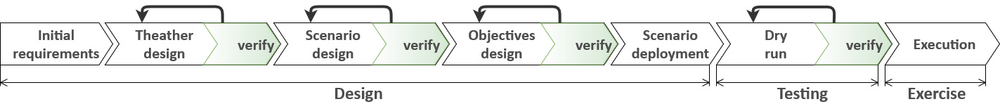

# Cyber Range Automated Construction Kit (CRACK)

**CRACK** is a framework for automating the *(i)* design, *(ii)* model *verification*, *(iii)* generation, and *(iv)* testing of cyber scenarios. 
The framework relies on **CRACK SDL**, a Scenario Definition Language based on [TOSCA](https://www.oasis-open.org/committees/tosca/), an OASIS standard for the specification and orchestration of virtual infrastructures. CRACK SDL allows for the declarative specification of the scenario elements and their interplay, e.g., a vulnerability affecting a system. 
Through a formal encoding of the properties of an SDL specification, CRACK also supports the automatic verification of a scenario against its training objectives.
After a successful verification, the scenario is automatically deployed in the Cyber Range and automatically tested to check the correspondence between the behavior of the deployed system and its specification.
